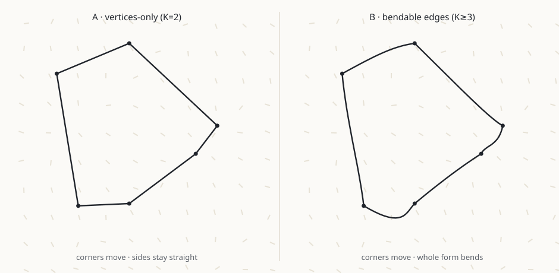
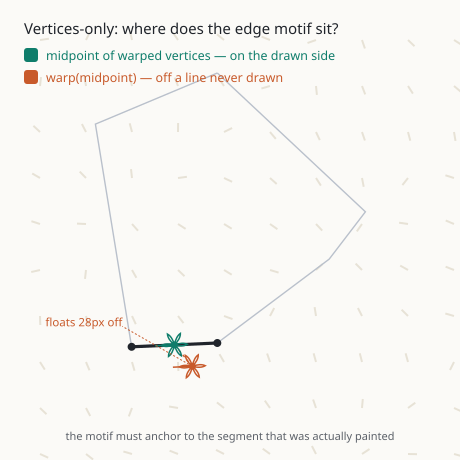
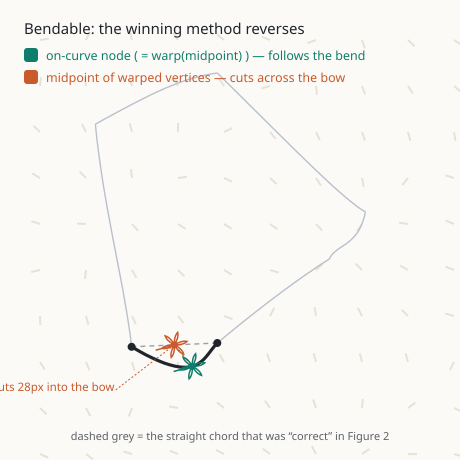

# Warp modes: vertices-only vs bendable edges
### …and why every motif anchor depends on knowing which one you're in

> **One-line takeaway.** A warped form can move its *corners* (rigid facets) or bend its *whole outline* (flowing). These are two different drawings — so a motif's anchor point must be derived from *the drawing that was actually made*. Use the wrong derivation and every rosette, dot, and glyph drifts off the geometry it's supposed to sit on. The correct method is not fixed — **it flips between the two modes.**

*Figures below are generated from the real warp primitive (gradient of a scalar field, magnitude-clamped) — the drift shown is measured, not illustrated. Amplitude is exaggerated for legibility.*

---

## 1 · A form can warp two ways

Naqsha displaces geometry by pushing points along a guide field. For a polygon there are two honest things "warp" could mean:

- **A · Vertices-only** — warp each corner; draw straight sides between the moved corners. The form becomes a set of tilted, rigid facets. (This is recursive geometry's behavior today.)
- **B · Bendable edges** — subdivide each side into *K* nodes, warp *every* node, and draw a smooth curve through them. The whole outline flows with the field. (This is how grid lines already warp.)

Both are desirable. In Naqsha they're the **two ends of one slider** — the same `warpNodes` control that grid uses. `K = 2` gives you vertices-only; sliding `K` up bends the edges. You move smoothly from faceted to flowing.

---

## 2 · Where does the motif sit? (vertices-only)

A motif bound to an **edge** anchors at that side's midpoint. Two plausible ways to compute it:

- **warp(midpoint)** — take the side's ideal midpoint, push it along the field.
- **midpoint of warped vertices** — warp the two corners, then take their midpoint.

They are *not* the same point, because the field's push at the midpoint differs from the average of its push at the two corners. In vertices-only mode the drawn side is a **straight segment between the two warped corners** — so only one of these lands on it:

The green rosette (midpoint of warped vertices) sits **on the drawn side**. The orange rosette (warp of the ideal midpoint) **floats off into space** — anchored to a line that was never drawn. Multiply this across every edge, tip, and cell of a recursive form and the motif layer visibly detaches from its host.

---

## 3 · Now bend the edges — and the correct method reverses

Slide `K` up so the sides actually bend. The drawn side is now a **curve** through warped nodes. Watch what happens to the same two candidate points:

The methods have **swapped roles**:

- **on-curve node** (green) — the warped node at the side's centre — now lies exactly on the bent curve. (This is literally `warp(midpoint)`, the method that was *wrong* in §2.)
- **midpoint of warped vertices** (orange) — the average of the two moved corners — now cuts straight across the bow, **inside** the curve. (This is the method that was *right* in §2.)

The dashed grey line is the straight chord that *was* the drawing in A. It isn't the drawing anymore.

> **This is the whole point.** There is no single "correct" anchor formula. The right derivation is a function of **which warp mode drew the form.** Pick one and hard-code it, and half your motifs are wrong half the time.

---

## 4 · The principle: anchors are mode-matched

The rule that falls out: **derive every anchor from the same geometry the renderer drew, in the mode it drew it.**

| anchor role | vertices-only (K=2) | bendable (K≥3) |
|---|---|---|
| **crossing** (vertex) | `warp(v)` — exact | `warp(v)` — exact (a warped node) |
| **edge** (side) | midpoint of warped vertices; tangent = warped-side direction — *exact, no estimation* | sample the bent curve on-curve → the capture path |
| **cell / tip** (centre) | centroid of warped vertices | `warp(centre)` + finite-difference frame |

Two invariants hold in **both** columns:

1. **One displacement primitive.** Every method above only ever calls `stackWarpDisplacement` — the single, shared warp function the renderer uses. Nothing re-implements the displacement, so the anchors can never drift from the paint by construction.
2. **Orientation follows the field.** A motif doesn't just translate to its anchor — it *rotates* to the local warp frame, so a rosette at a bent crossing leans the way the form leans.

---

## 5 · The decision, as posed

> **Q — Recursive structural anchors: derive from the warped vertices, or point-warp each anchor's ideal position? And since I want to warp not just the vertices but the whole line (bendable), like grid — can both be built?**

**A — Both, and they aren't rivals: each matches a render mode, selected by the `warpNodes` bend slider.**

- `K = 2` → **vertices-only**: warp corners, straight sides, anchors *derived from warped vertices* (exact — edge tangents come for free from the warped-side direction).
- `K ≥ 3` → **bendable edges**: subdivide every side, warp all nodes (recursive never pins), smooth curve; structural anchors use *point-warp + finite-difference frame*, and along-edge anchors ride the capture path.

Recursive reuses grid's exact machinery (`catmullRomToBezier` + the warp loop), minus endpoint-pinning. The bendable render mode is a genuine new renderer feature — carved as its own build slice so it's visible, not smuggled in.

---

## Appendix · why the two points differ (the math)

For a side with endpoints `a, b` and displacement field `d(·)`:

- **midpoint of warped vertices** `= ½·(a + d(a)) + ½·(b + d(b)) = m + ½·(d(a)+d(b))`, where `m = (a+b)/2`.
- **warp(midpoint)** `= m + d(m)`.

They coincide only when `d(m) = ½·(d(a)+d(b))` — i.e. when the field is **linear** across the side. Real guide fields never are, so the gap `d(m) − ½(d(a)+d(b))` is exactly the "sagitta" you see the orange rosette occupy. In vertices-only mode the drawing keeps the *chord*, so the chord-midpoint (first formula) is on it. In bendable mode the drawing keeps the *curve*, whose centre node is `m + d(m)` (second formula). Same two expressions, opposite winners — which is why the anchor extractor has to know the mode.
